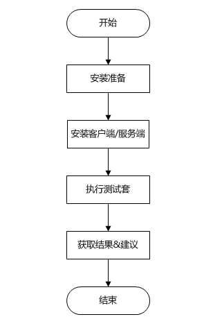
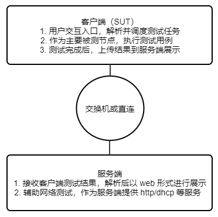
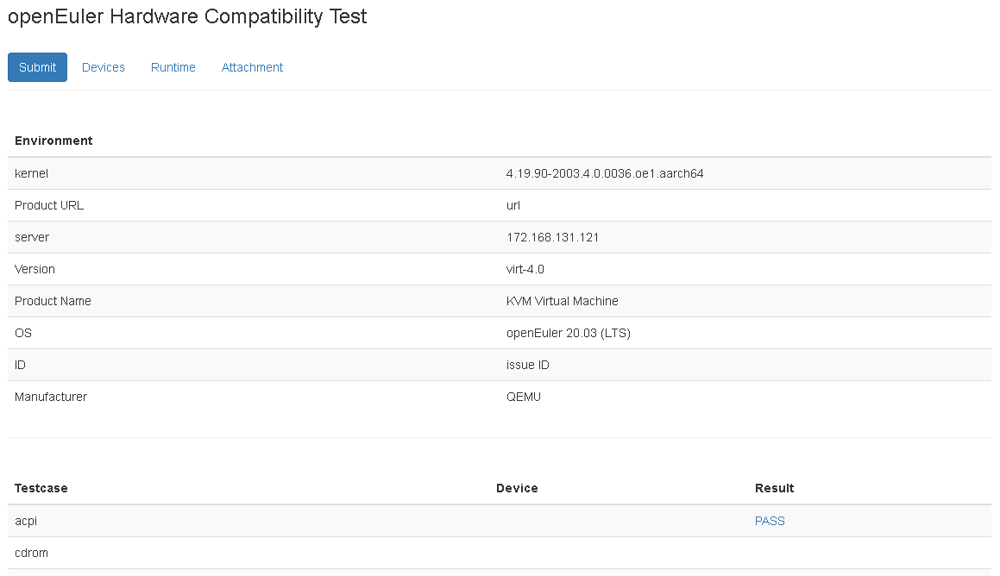

<!-- TOC -->

- [概述](#概述)
  - [背景介绍](#背景介绍)
  - [原理简介](#原理简介)
    - [框架概览](#框架概览)
    - [测试流程](#测试流程)
  - [使用流程](#使用流程)
    - [用户使用流程](#用户使用流程)
    - [组网图](#组网图)
- [安装测试框架](#安装测试框架)
  - [前提条件](#前提条件)
  - [获取安装包](#获取安装包)
  - [安装过程](#安装过程)
    - [客户端](#客户端)
    - [服务端](#服务端)
  - [验证安装正确性](#验证安装正确性)
- [使用指导](#使用指导)
  - [前提条件](#前提条件-1)
  - [使用步骤](#使用步骤)
- [查看结果](#查看结果)
  - [如何查看](#如何查看)
  - [结果说明&建议](#结果说明建议)
- [附录：测试项说明](#附录测试项说明)
  - [已有测试项](#已有测试项)
  - [新增测试项](#新增测试项)

<!-- /TOC -->

# 概述

## 背景介绍

OS 厂商为了扩大自己产品的兼容性范围，常常寻求与硬件厂商的合作，进行兼容性测试。OS 厂商制定一个测试标准，并提供测试用例，硬件厂商进行实际的测试，测试通过后，OS 厂商和硬件厂商将共同对结果负责。这是一个双赢的合作，双方都可以藉此推销自己的产品。

认证目的就是保证 OS 与硬件平台的兼容性，认证仅限于基本功能验证，不包括性能测试等其它测试。

欧拉硬件兼容性认证测试框架有如下特点：

1. 为满足可信要求，必须使用欧拉操作系统，不能随意重编/插入内核模块。
2. 通过扫描机制自适应发现硬件列表，来确定要运行的测试用例集合。
3. 面向对象抽象各种硬件类型以及测试用例类，用于扩展开发。

## 原理简介

### 框架概览

```
.
├── hwcert   框架主功能
│   ├── compatibility.py  框架核心功能
│   ├── client.py         上传测试结果到服务端
│   ├── command.py        bash命令执行封装
│   ├── commandUI.py      命令行交互工具
│   ├── device.py         扫描设备信息
│   ├── document.py       收集配置信息
│   ├── env.py            全局变量，主要是各个配置文件或目录的路径
│   ├── job.py            测试任务管理
│   ├── log.py            日志模块
│   ├── reboot.py         重启类任务专用，便于机器重启后仍能继续执行测试
│   ├── sysinfo.py        收集系统信息
│   └── test.py           测试套模板
├── scripts   工具脚本
│   ├── oech                  框架命令行工具
│   ├── oech-server.service   框架服务端 service 文件，用于启动 web 服务器
│   ├── oech.service          框架客户端 service 文件，用于接管 reboot 用例
│   └── kernelrelease.json    规范可用于认证的系统和内核版本
├── server   服务端
│   ├── oech-server-pre.sh    服务预执行脚本
│   ├── results/              测试结果存放目录
│   ├── server.py             服务端主程序
│   ├── static/               图片存放目录
│   ├── templates/            网页模板存放目录
│   ├── uwsgi.conf            nginx 服务配置
│   └── uwsgi.ini             uwsgi 服务配置
└── tests   测试套
```


### 测试流程


## 使用流程

### 用户使用流程



### 组网图



# 安装测试框架

## 前提条件

安装了 EulerOS 2.0 (SP8) 及更高版本，或 openEuler 20.03 (LTS) 及更高版本。

## 获取安装包

* 安装包从 openEuler 官方网站下载。

* 校验安装包的完整性。

  1. 获取校验文件中的校验值：

     ```
     cat oec-hardware-*.rpm.sha256sum
     ```

  2. 计算文件的sha256校验值:

     ```
     sha256sum oec-hardware-*.rpm
     ```

     命令执行完成后，输出校验值。

  3. 对比步骤1和步骤2计算的校验值是否一致。

     如果校验值一致说明安装文件完整性没有破坏，如果校验值不一致则可以确认文件完整性已被破坏，需要重新获取。

## 安装过程

### 客户端

1. 部分基础用例依赖 fio 和 memtester 工具，需要提前安装依赖（可以用 tools/ 里的源码包编译）。

   ```
   rpm -ivh fio-3.7-2.aarch64.rpm memtester-4.3.0-13.aarch64.rpm
   ```

2. 安装 oec-hardware-1.0.0-h1.aarch64.rpm。

   ```
   dnf install oec-hardware-1.0.0-h1.aarch64.rpm
   ```


### 服务端

1. 安装服务端子包。

   ```
   dnf install oec-hardware-server-1.0.0-h1.aarch64.rpm
   ```

2. 服务端 web 展示页面部分组件系统本身不提供，需要使用 pip 安装（请自行配置可用 pip 源）。

   ```
   pip3 install Flask Flask-bootstrap uwsgi
   ```

3. 启动服务。本服务默认使用 8080 端口，同时搭配 nginx（默认端口 80）提供 web 服务，请保证这些端口未被占用。

   ```
   systemctl start oech-server.service
   systemctl start nginx.service
   ```

4. 关闭防火墙和 SElinux。

   ```
   systemctl stop firewalld
   iptables -F
   setenforce 0
   ```

## 验证安装正确性

客户端输入 `oech` 命令，可正常运行，则表示安装成功。如果安装有任何问题，可反馈至该邮箱：oecompatibility@openeuler.org 。

# 使用指导

## 前提条件

* `/usr/share/oech/kernelrelease.json`文件中列出了当前支持的所有系统版本，使用`uname -a` 命令确认当前系统内核版本是否属于框架支持的版本。

* 框架默认会扫描所有网卡，对网卡进行测试前，请自行筛选被测网卡，并给它配上能`ping`通服务端的 ip  ；如果是测试客户端 `InfiniBand`网卡，服务端也必须有一个 `InfiniBand`网卡并提前配好 ip 。

## 使用步骤

1. 在客户端启动测试框架。在客户端启动 `oech`，其中 `ID` 和 `URL` 可以按需填写，`Server` 必须填写为客户端可以直接访问的服务器域名或 ip，用于展示测试报告和作网络测试的服务端。

   ```
   # oech
   The openEuler Hardware Compatibility Test Suite
   Please provide your Compatibility Test ID:
   Please provide your Product URL:
   Please provide the Compatibility Test Server (Hostname or Ipaddr):
   ```

2. 进入测试套选择界面。在用例选择界面，框架将自动扫描硬件并选取当前环境可供测试的测试套，输入 `edit` 可以进入测试套选择界面。

   ```
   These tests are recommended to complete the compatibility test:
   No. Run-Now?  Status  Class         Device
   1     yes     NotRun  acpi
   2     yes     NotRun  clock
   3     yes     NotRun  cpufreq
   4     yes     NotRun  disk
   5     yes     NotRun  ethernet      enp3s0
   6     yes     NotRun  ethernet      enp4s0
   7     yes     NotRun  ethernet      enp5s0
   8     yes     NotRun  kdump
   9     yes     NotRun  memory
   10    yes     NotRun  perf
   11    yes     NotRun  system
   12    yes     NotRun  usb
   13    yes     NotRun  watchdog
   Ready to begin testing? (run|edit|quit)
   ```

3. 选择测试套。`all|none` 分别用于 `全选|全取消`（必测项 `system` 不可取消）；数字编号可选择测试套，每次只能选择一个数字，按回车符之后 `no` 变为 `yes`，表示已选择该测试套。

   ```
   Select tests to run:
   No. Run-Now?  Status  Class         Device
   1     no      NotRun  acpi
   2     no      NotRun  clock
   3     no      NotRun  cpufreq
   4     no      NotRun  disk
   5     yes     NotRun  ethernet      enp3s0
   6     no      NotRun  ethernet      enp4s0
   7     no      NotRun  ethernet      enp5s0
   8     no      NotRun  kdump
   9     no      NotRun  memory
   10    no      NotRun  perf
   11    yes     NotRun  system
   12    no      NotRun  usb
   13    no      NotRun  watchdog
   Selection (<number>|all|none|quit|run):
   ```

4. 开始测试。选择完成后输入 `run` 开始测试。

5. 上传测试结果。测试完成后可以上传测试结果到服务器，便于结果展示和日志分析。如果上传失败，请检查网络配置，然后重新上传测试结果。

   ```
   ...
   -------------  Summary  -------------
   ethernet-enp3s0                  PASS
   system                           FAIL
   Log saved to /usr/share/oech/logs/oech-20200228210118-TnvUJxFb50.tar succ.
   Do you want to submit last result? (y|n) y
   Uploading...
   Successfully uploaded result to server X.X.X.X.
   ```


# 查看结果

## 如何查看

1. 浏览器打开服务端 IP 地址，点击导航栏 `Results` 界面，找到对应的测试 id 进入。

   

2. 进入单个任务页可以看到具体的测试结果展示，包括环境信息和执行结果等。

   - `Submit` 表示将结果上传到欧拉官方认证服务器（**当前尚未开放**）。

   - `Devices` 查看所有测试设备信息。

   - `Runtime` 查看测试运行日志。

   - `Attachment` 下载测试附件。

     


## 结果说明&建议

在 **Result** 列展示测试结果，结果有两种：**PASS** 或者 **FAIL**。如果结果为**FAIL**，可以直接点击结果来查看执行日志，根据报错对照用例代码进行排查。

# 附录：测试项说明

## 已有测试项

1. **system**

   - 检查 OS 版本和 kernel 版本是否匹配。
   - 检查安装的认证工具是否有被修改。
   - 检查内核是否被感染。
   - 检查 selinux 是否正常。
   - 使用 dmidecode 工具读取硬件信息。

2. **cpufreq**

   - 测试 cpu 在不同调频策略下运行频率是否同预期。
   - 测试 cpu 在不同频率下完全同规格计算量所需时间是否与频率值反相关。

3. **clock**

   - 测试时间矢量性，不会倒回。
   - 测试 RTC 硬件时钟基本稳定性。

4. **memory**

   - 使用 memtester 工具进行内存读写测试。
   - mmap 全部系统可用内存，触发 swap，进行 120s 读写测试。
   - 测试 hugetlb。
   - 内存热插拔测试。

5. **network**

   - 使用 ethtool 获取网卡信息和 ifconfig 对网卡进行 down/up 测试。
   - 使用 qperf 测试以太网卡tcp/udp延迟和带宽，以及 http 上传、下载速率。
   - 使用 perftest 测试 InfiniBand 或 RoCE 网卡延迟和带宽。
   - **注意** 进行网络带宽测试时，请提前确认服务端网卡速率不小于客户端，并保证测试网络无其他流量干扰。

6. **disk**

   使用 fio 工具进行裸盘/文件系统的顺序/随机读写测试。

7. **kdump**

   触发 kdump，测试能否正常生成 vmcore 文件并解析。

8. **watchdog**

   触发 watchdog，测试系统是否可以正常复位。

9. **perf**

   测试 perf 工具是否能正常使用。

10. **cdrom**

    使用 mkisofs 和 cdrecord 对光驱进行刻录和读取测试。

11. **ipmi**

    使用 ipmitool 查询 IPMI 信息。

12. **nvme**

    使用 nvme-cli 工具对盘进行格式化、读写、查询测试。

13. **tape**

    测试磁带是否正常读写。

14. **usb**

    插拔 usb 设备，测试 usb 接口能否正常识别。

15. **acpi**

    利用 acpidump 工具读取数据。

## 新增测试项

1. 在 `tests/` 添加自己的测试模板，实现自己的测试类继承框架 `Test`。

2. 重要成员变量或函数。

   - 函数 `test` - **必选**，测试主流程。

   - 函数 `setup` - 测试开始前环境准备，主要用于初始化被测设备相关信息，可以参考 network 测试。

   - 函数 `teardown` - 测试完成后环境清理，主要用于确保无论测试成功失败都能正确恢复环境，可以参考 network 测试。

   - 变量 `requirements` - 以数组形式存放测试依赖的 rpm 包名，测试开始前框架自动安装。

   - 变量 `reboot` 和 `rebootup` - 若 `reboot = True` 表示该测试套/测试用例会重启系统，且在重启后继续执行 `rebootup` 指定的函数，可以参考 kdump 测试。
